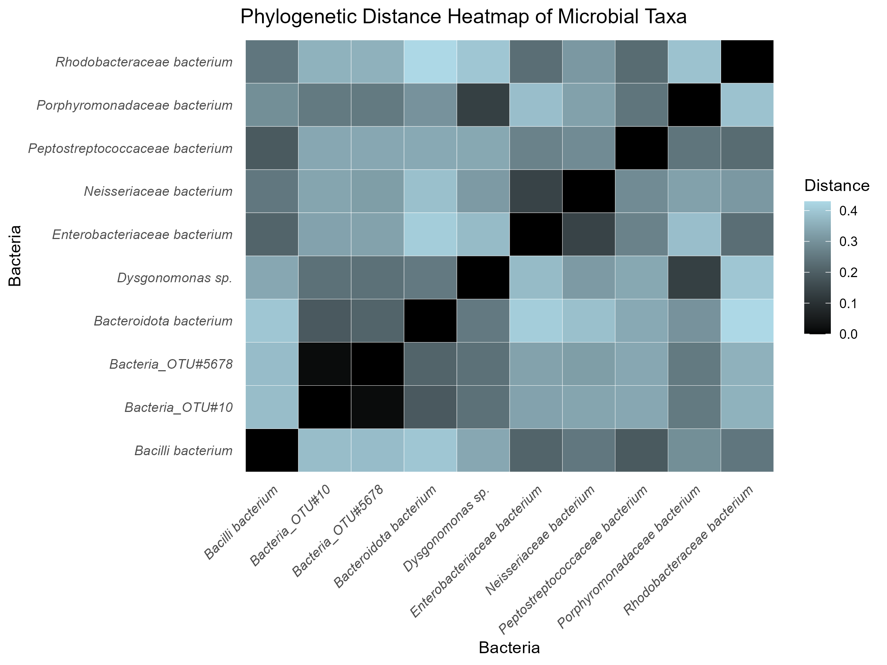
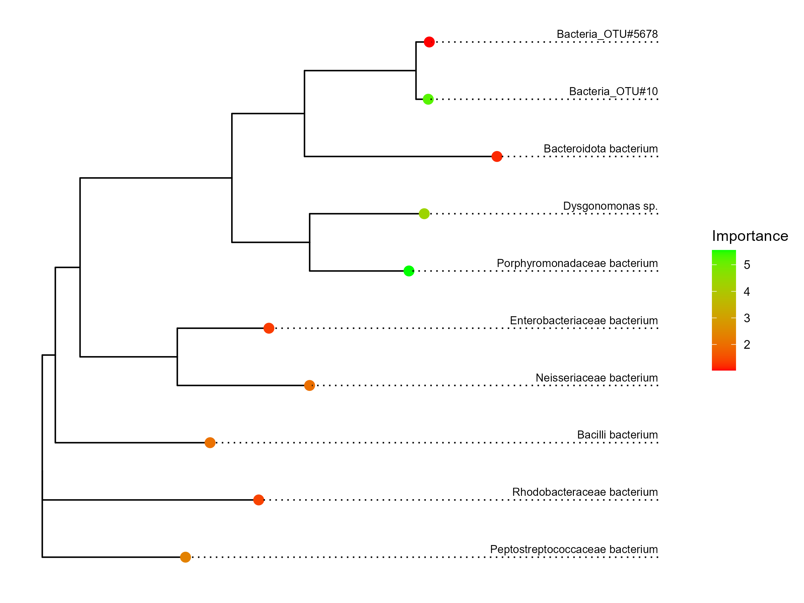

# Final Report

-   Can we delete "old code" from barplots.R

## Group Members

Bonnie Rule (20295738),

Mackenzie Calhoun (20265644),

Amyre Wells (20320047),

Jennah Levac (20169998),

Taylor Pontet-Dasilva (20310351),

Nithila Sathieskumar (20279386)

## Project Setup

***github***

<https://github.com/amyrewells/432_Final>

***data acquisition***

Data is from: <https://doi.org/10.5061/dryad.vq744> (just the OTU table and mapping.txt). This data can be found in ./data/input

Sequences available through NCBI (Accession numbers KX459698–KX460822)

***data transformation***

Abundance data from the OTU table was transformed into relative abundance data. This was done to ensure we investigate the relative make-up of microbe communities, without confounding differences in microbe abundance between samples.

Data was then cleaned and filtered so only microbe OTUs representing over 0.5% of the microbes sampled were kept. This was done as a feature selection step to prevent over-fitting in the models to be run.

Filtered data was then merged with relevant mapping data to categorize samples by species.

The scripts preforming these transformations can be found in ./data/transformations. The data files used for analysis are found in ./data.

## Question 1-

### A- Do microbiome communities significantly differ between *E. intermedius* and *E. triangulatus* dung beetle species?

To investigate this question, we utilized NMDS plots to determine whether beetle samples cluster by species, based on their microbe communities.

```{r}
load("./Figures/NMDSPlot.RData")
NMDS_plot
```

**Figure 1.** Non-metric multidimensional scaling (NMDS) plot of dung beetle species microbe composition based on Bray-Curtis distances. Points represent individual samples, with colors indicating species.

Visually from the plot, we see that samples tend to cluster in distinct groups, but that those groups show no clear association between dung beetle species and microbial communities. Some other factor is likely influencing microbial communities, and we beleive this factor is the life stages of the beetle samples, which was investigated in the original paper from which this data originates (Shukla SP, Sanders JG, Byrne MJ, Pierce NE. Gut microbiota of dung beetles correspond to dietary specializations of adults and larvae. Mol Ecol. 2016;25(24):6092-6106. <doi:10.1111/mec.13901>).

To confirm our initial observations, we investigated the significance of species on NMDS axis using linear models.

```{r}
load("./Figures/NMDS1_lm.RData")
NMDS1_lm
```

**Figure 2**. Boxplot depicting relationship between NMDS1 axis and dung beetle species. Points represent individual samples, with black bars representing means. The red line indicates the linear model of the relationship, though it is not significant (p= 0.960)

```{r}
load("./Figures/NMDS2_lm.RData")
NMDS2_lm
```

**Figure 3**. Boxplot depicting relationship between NMDS1 axis and dung beetle species. Points represent individual samples, with black bars representing means. The red line indicates the linear model of the relationship, though it is not significant (p= 0.409).

As expected, the p-values showed that species did not have a significant effect on NMDS axes (NMDS1: p= 0.960, NMDS2: p= 0.409).

The code used to perform this section of analysis can be found in the markdown file named "NMDS & Linear Model.Rmd".

### B- Can these differences be used to predict species classification?

Despite the above findings, by fitting a Random Forest model, we revealed that the make-up of microbial communities can be used to classify *E. intermedius* and *E. triangulatus* dung beetle samples with 88.89% accuracy. The confusion matrix of this model is shown in Table 1.

**Table 1**. Confusion Matrix for Random Forest model classifying beetle species from microbe community data. Cohen's Kappa for this table is 0.7662.

```{r}
load("./Figures/RFConfusionMatrix.RData")
print(confusion_matrix)
```

This suggests that microbial communities perform decently well as a metric to classify beetle samples by species.

Additionally, we looked at which OTUs were most important in classifying decisions.

**Table 2.** Most important microbe OTUs in classifying beetle species. OTU IDs were ranked based on their Mean Decreasing Accuracy Score, so that most important are at the top of the list, and the least important are at the bottom.

```{r}
top_10<- read.csv("./data/top_10.csv")
top_10
```

This importance data will be used for analysis in a later sections.

Code used to perform this section of analysis can be found in file named RandomForest.csv

### C- How do microbial communities differ between samples of different species?

We decided to compare the absolute abundance of the most important OTUs in *E. intermedius* and *E. triangulatus* species.

```{r}
load("./Figures/barplot.RData")
print(barplot)
```

**Figure 4**. Caption.

As shown in Figure 4, abundance of each OTU varies across species. Interestingly, Dysgonomonas is found only in *E. intermedius* and Porphyromonadaceae is found only in *E. triangulatus* species. This would explain why these OTUs have an important effect on classifying beetle samples by species.

Code for this plot creation can be found in the barplots.R script.

## Question 2-

### How do relevant microbial communities of the dung beetle species differ in terms of phylogenetic relationship?

To investigate, we acessed the sequences of the top 10 important OTU (determined in Random Forest model) via NCBI. We created a distance matrix of these aligned sequences. A heatmap was used to visualize distances and can be found in Figure 5.



**Figure 5**. Caption.

Next, this data was compiled into a phylogenetic tree using the neighbour-joining method.



**Figure 6**. Caption.

According to Figure 5, Dysgonomonas sp. and Porphyromonadaceae have a low phylogenetic distance (0.135), suggesting they are closely related. This aligns with their placement in the phylogenetic tree (Figure 6) which, in addition to their high importance (4.35 and 5.55, respectively) in distinguishing beetle species, highlights their potential co-evolution with dung beetle hosts. Their similarity suggests they may have adapted to the beetle gut environment through niche specialization and host-microbe interactions. For instance, both bacteria are known to share similar roles in beetle digestion.

Similarly, Bacteria_OTU#5678 and Bacteria_OTU#10 appear very closely related (0.016), which could be due to their weak taxon assignment. Notably, while both bacteria play a role in distinguishing beetle species, Bacteria_OTU#10 serves as a stronger predictor (5.22), suggesting it has undergone greater evolutionary specialization. In contrast, Bacteria_OTU#5678 may have maintained a more generalized role, as indicated by its much lower predictive power (1.02).

Contrarily, the distant evolutionary relationship (0.43) and lower predictive importance (1.39 and 1.17, respectively) of Rhodobacteraceae and Bacteroidota suggest they have not undergone host-driven specialization in our dung beetle species. This suggests their presence is driven mostly by external environmental factors, which is corroborated by the fact that Bacteroidota are often associated with anaerobic environments while Rhodobacteraceae are typically aerobic, photosynthetic, or marine-associated bacteria.

Overall, these distinctions provide insight into how bacterial lineages can diversify under dung beetle host selection pressures, therefore shaping microbial evolution and overall community structure.

Code used for this section of the analysis can be found in the script file Phylogeny.R.

## Conclusions

In conclusion, microbe communities do not significantly differ between beetle species. However, microbe community data can still be used to classify samples by Species with decent accuracy (\~89%). Some OTUs with large differences in abundance between species are Dysgonomonas and Porphyromonadaceae.

The important OTU phylogeny revealed interesting insights into how bacterial lineages can diversify under dung beetle host selection pressures. In the future, this reasearch could be applied to expanded to investigate environmental factors and functional roles of microbes that ultimately contribute to microbial community differences in dung beetle species.
